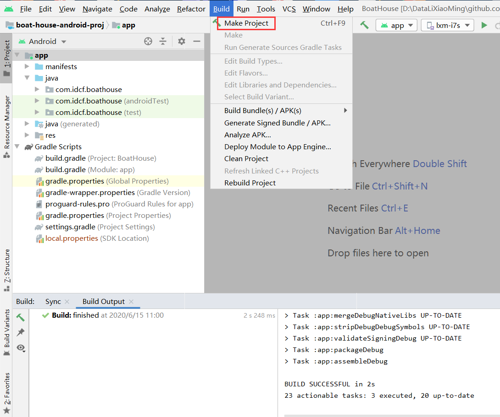
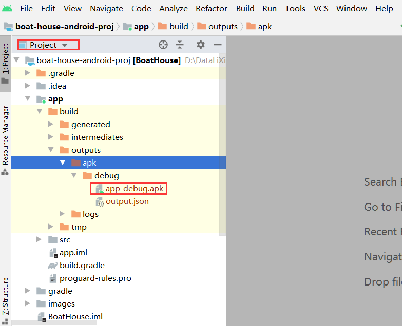

# boat-house 船屋餐饮系统Android端

## IDCF Boat House 移动端 介绍 

通过此移动端App，可使用手机浏览菜品，自助点餐等。。


## 系统架构 

安卓原生app, 基于MVP架构开发。

移动开发各种架构和技术选型请参考：**[移动APP开发框架盘点](src/boat-house-android-proj/mobile-app-architecture.md)**。

## 现有功能

* Fragment.
* WebView.
* MVP.

## Logo && 预览

 |  | 


## 开发环境

- Android Studio 3.6+ (当前调试环境为4.0)

- Gradle版本:3.6.1


## 目录介绍

#### `.github`: github action 流水线

#### `devops`: 自动化相关目录，如jenkins流水线

#### `test`: 单元测试和自动化测试

#### `src/boat-house-android-proj` Andorid studio 项目目录

#### android 目录结构


* base: Activity & Fragment Base类
* mvp: MVP的Base类都在这里面
* presentation: 主要包，其中的Contract类是定义View和Presenter接口的地方
* util: 通用工具包
* App: Application
* AppRouter: App路由，界面跳转帮助类，所有的界面跳转通过此类进行跳转,包括组件交互


## 开发/调试环境配置

#### 开发环境

### Windows

- 配置java开发环境
- 安装 Android Studio， 版本至少 3.6+ (当前调试环境为4.0)
- 使用git clone github仓库： https://github.com/idcf-boat-house/boat-house-mobile-android
- 打开Android Studio，打项目（boat-house-android-proj）
- gradle同步前，国内环境可能需要挂代理
- 编译项目

- 可以在本地创建Anroid模拟器，然后调试App
- 编译成功之后，在目录中可以找到打包后的apk:
 

### 使用 docker 镜像build 并生成apk

- docker image 地址： https://hub.docker.com/r/cangol/android-gradle
- dockerfile及github仓库： https://github.com/Cangol/android-gradle-docker
- 运行以下命令  
   >注意，下面的参数 `$(pwd):/opt/workspace`  表示 将当前Android项目目录映射至 docker容器内的 `/opt/workspace`目录中

    `cd [android 项目所在目录 boat-house/src/boat-house-android-proj]`

    `docker pull cangol/android-gradle`

    `docker run --tty --interactive --volume=$(pwd):/opt/workspace --workdir=/opt/workspace --rm cangol/android-gradle  /bin/sh -c "./gradlew assembleDebug"`

- 执行完成后，在容器外部的 `src/boat-house-android-proj/app/build/outputs/apk/debug` 目录中可找到apk文件。

   


## DevOps

自动化集成和发布 Pipeline 。

#### 使用 jenkins 自动打包

- 文档，jenkins流水线配置请参考团队上手文档
- Demo流水线地址：[点击这里](http://jenkins.devopshub.cn/blue/organizations/jenkins/boat-house-mobile-android/activity)

- 脚本详细见：[devops/jenkins/Jenkinsfile](/devops/jenkins/Jenkinsfile)

- 实现方式：使用上面提到的docker image `cangol/android-gradle` 进行编译和打包，并上传至jenkins流水线的制品中（[查看这个build 历史](http://jenkins.devopshub.cn/blue/organizations/jenkins/boat-house-mobile-android/detail/master/6/pipeline) ）。

#### 使用 Github Action 自动打包

- 文档，Github Action 创建请参考文档：[Github 官方文档](https://help.github.com/cn/actions/configuring-and-managing-workflows/configuring-a-workflow)
- Demo 流水线地址：[点击这里](https://github.com/idcf-boat-house/boat-house-mobile-android/actions?query=workflow%3A%22test+and+build%2Fpackage+anroid+apk%22)
- 脚本详细见：[.github/workflows/android-client.yml](/.github/workflows/android-client.yml)
- 实现方式： 使用 上面提到的docker image `cangol/android-gradle` 进行编译和打包，并上传至 Github Action Build中（[查看这个build 历史](https://github.com/idcf-boat-house/boat-house-mobile-android/actions/runs/140756859) ）。


## 测试

自动化测试暂无。

## 常见问题

- gradle代理问题
当设置 Andorid Studio 好代理后，gradle还是报连接问题时,请检查 gradle.properties文件中关于代理的配置（Win系统此文件通常在目录: `C:\Users\[当前用户名]\.gradle`中），正确的相关配置如下：
    ```
    systemProp.https.proxyPort=25376
    systemProp.http.proxyHost=127.0.0.1
    systemProp.http.socks=25376
    systemProp.https.socks=127.0.0.1
    systemProp.https.proxyHost=127.0.0.1
    systemProp.http.proxyPort=25376
    ```

- not found gradlew 
在本地或调试流水线时，如果命令行报类似错误，则需对`gradlew` 命令文件进行授权：`chmod +x src/boat-house-android-proj/gradlew `

- jenkins流水线执行时，清理原仓库内容时报权限错误

    ```
    hudson.plugins.git.GitException: Command "git clean -fdx" returned status code 1:

    xxxxx

    stdout: 

    stderr: warning: failed to remove src/boat-house-android-proj/.gradle/buildOutputCleanup/outputFiles.bin: Permission denied

    warning: failed to remove src/boat-house-android-proj/.gradle/buildOutputCleanup/cache.properties: Permission denied

    warning: failed to remove src/boat-house-android-proj/.gradle/buildOutputCleanup/buildOutputCleanup.lock: Permission denied

    xxxxx
    ```
    需进入 jenkins slave,即执行流水线的那台服务器，手工清理工作目录的文件即可。
    ```
    cd workspace
    sudo rm -rf *
    ```
